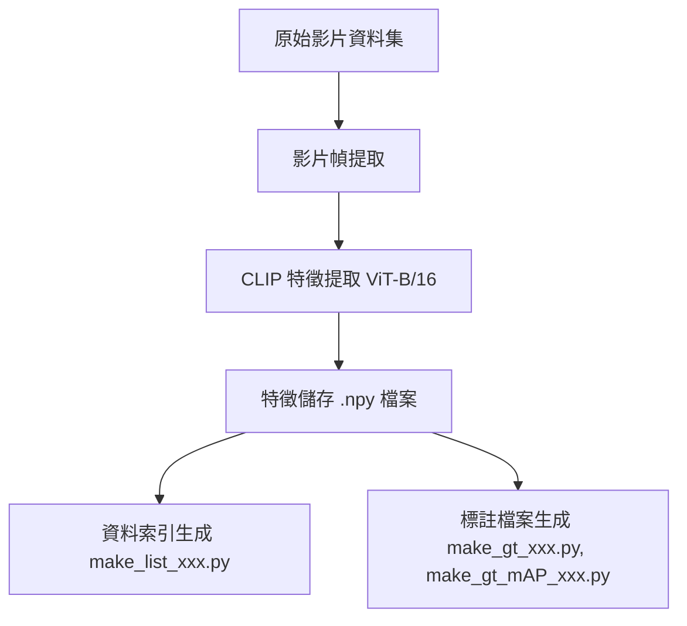
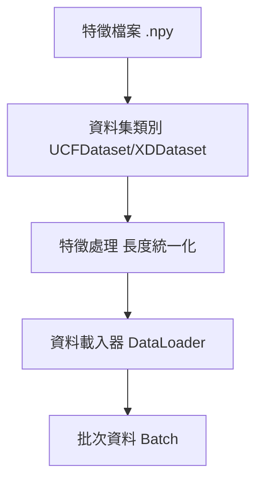
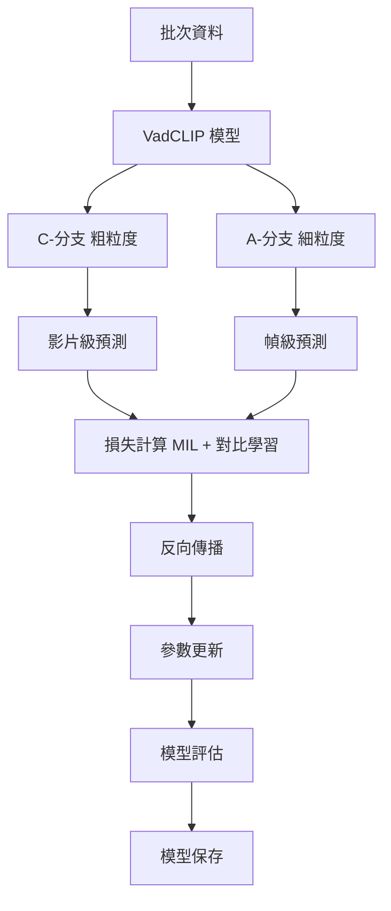
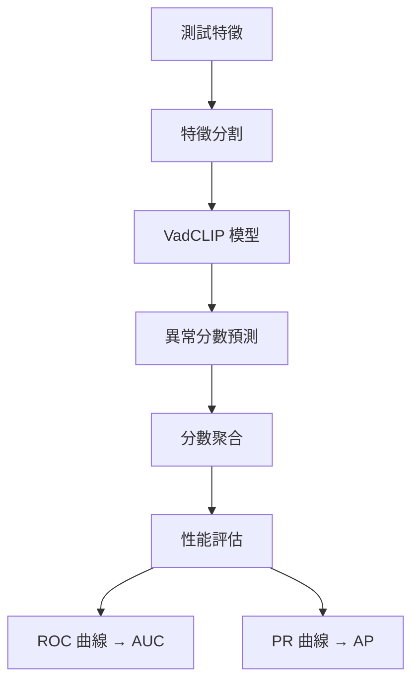
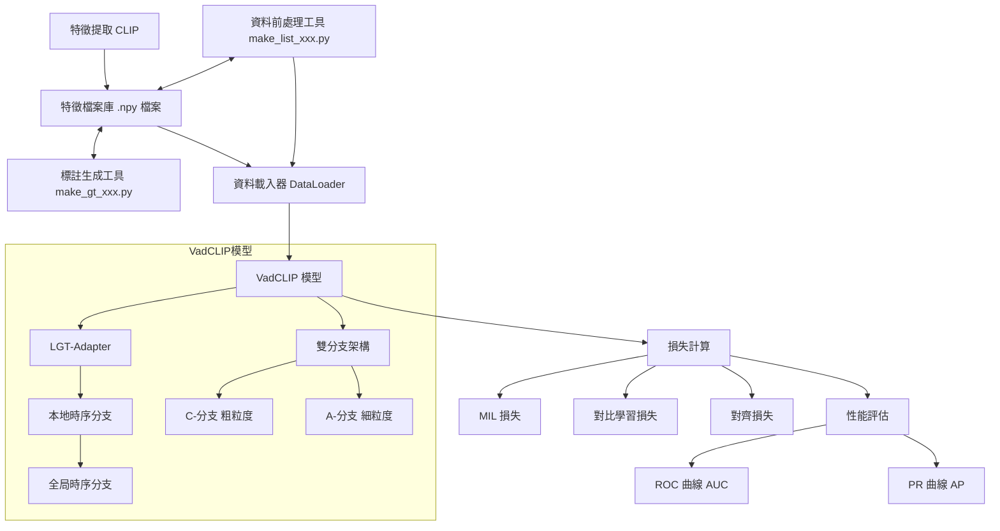

# VadCLIP: 基於視覺語言模型的弱監督影片異常檢測

## 目錄
- [專案概述](#專案概述)
- [系統需求](#系統需求)
- [專案架構](#專案架構)
- [模型架構](#模型架構)
- [資料處理流程](#資料處理流程)
- [訓練流程](#訓練流程)
- [推理與評估](#推理與評估)
- [使用說明](#使用說明)
- [實驗結果](#實驗結果)
- [資料前處理工具](#資料前處理工具)
- [完整流程圖](#完整流程圖)

## 專案概述

VadCLIP 提出了一個創新的弱監督影片異常檢測範式，主要創新點包括：

1. 直接利用凍結的 CLIP 模型進行特徵提取，無需額外預訓練或微調
2. 採用雙分支架構，同時實現粗粒度和細粒度的異常檢測
3. 引入本地-全局時序適配器(LGT-Adapter)來建模時序關係
4. 設計可學習提示和視覺提示機制，有效適配預訓練知識
5. 提出 MIL-Align 機制來優化對齊範式

## 專案架構

```
VadCLIP/
├── src/                    # 源碼目錄
│   ├── model.py           # 核心模型定義
│   ├── ucf_train.py       # UCF-Crime 訓練主程式
│   ├── ucf_test.py        # UCF-Crime 測試程式
│   ├── xd_train.py        # XD-Violence 訓練主程式
│   ├── xd_test.py         # XD-Violence 測試程式
│   ├── ucf_option.py      # UCF-Crime 參數配置
│   ├── xd_option.py       # XD-Violence 參數配置
│   ├── utils/             # 工具函數目錄
│   │   ├── dataset.py     # 資料集處理
│   │   ├── layers.py      # 自定義網路層
│   │   ├── lr_warmup.py   # 學習率預熱
│   │   ├── tools.py       # 通用工具函數
│   │   ├── ucf_detectionMAP.py  # UCF-Crime 評估
│   │   └── xd_detectionMAP.py   # XD-Violence 評估
│   └── clip/              # CLIP 模型相關程式碼
├── data/                   # 資料集目錄
│   ├── UCF-Crime/         # UCF-Crime 資料集
│   └── XD-Violence/       # XD-Violence 資料集
└── list/                   # 資料集索引檔案
    ├── ucf_train.csv      # UCF-Crime 訓練集清單
    ├── ucf_test.csv       # UCF-Crime 測試集清單
    ├── xd_train.csv       # XD-Violence 訓練集清單
    ├── xd_test.csv        # XD-Violence 測試集清單
    ├── make_list_ucf.py   # 生成 UCF-Crime 資料集索引檔案
    ├── make_gt_ucf.py     # 生成 UCF-Crime 資料集標註檔案
    ├── make_gt_mAP_ucf.py # 生成 UCF-Crime 資料集 mAP 評估用標註
    ├── make_list_xd.py    # 生成 XD-Violence 資料集索引檔案
    ├── make_gt_xd.py      # 生成 XD-Violence 資料集標註檔案
    ├── make_gt_mAP_xd.py  # 生成 XD-Violence 資料集 mAP 評估用標註
    └── 其他資料集相關檔案  # 包括標註文件和生成的標註數組
```

## 資料處理流程

### 1. 影片特徵提取

#### 1.1 前置處理
- 使用 CLIP ViT-B/16 模型提取特徵
- 每個影片幀轉換為 512 維特徵向量
- 特徵以 NumPy 數組格式儲存為 .npy 檔案

#### 1.2 特徵檔案格式
```python
# 特徵數組結構
feature_array.shape = [影片幀數, 512]
```

### 2. 特徵處理策略

#### 2.1 長度統一化
```python
# 來源檔案: src/utils/tools.py
def process_feat(feat, length, is_random=False):
    if feat.shape[0] > length:  # 影片過長
        if is_random:
            return random_extract(feat, length)  # 隨機採樣
        else:
            return uniform_extract(feat, length)  # 均勻採樣
    else:  # 影片過短
        return pad(feat, length)  # 零填充
```

#### 2.2 採樣方法

##### 均勻採樣
```python
# 來源檔案: src/utils/tools.py
def uniform_extract(feat, t_max, avg=True):
    new_feat = np.zeros((t_max, feat.shape[1])).astype(np.float32)
    if avg:
        # 計算區間平均值
        r = np.linspace(0, len(feat), t_max+1, dtype=np.int32)
        for i in range(t_max):
            if r[i] != r[i+1]:
                new_feat[i,:] = np.mean(feat[r[i]:r[i+1],:], 0)
            else:
                new_feat[i,:] = feat[r[i],:]
    else:
        # 線性採樣
        r = np.linspace(0, feat.shape[0]-1, t_max, dtype=np.uint16)
        new_feat = feat[r, :]
    return new_feat
```

##### 隨機採樣
```python
# 來源檔案: src/utils/tools.py
def random_extract(feat, t_max):
    r = np.random.randint(feat.shape[0] - t_max)
    return feat[r : r+t_max, :]  # 擷取連續片段
```

#### 2.3 填充處理
```python
# 來源檔案: src/utils/tools.py
def pad(feat, min_len):
    clip_length = feat.shape[0]
    if clip_length <= min_len:
        return np.pad(feat, 
                     ((0, min_len - clip_length), (0, 0)),
                     mode='constant', 
                     constant_values=0)
    return feat
```

### 3. 資料載入機制

```python
# 來源檔案: src/utils/dataset.py
class UCFDataset(data.Dataset):
    def __getitem__(self, index):
        # 載入特徵
        clip_feature = np.load(self.df.loc[index]['path'])
        
        if not self.test_mode:
            # 訓練模式：特徵處理
            clip_feature, clip_length = tools.process_feat(
                clip_feature, 
                self.clip_dim
            )
        else:
            # 測試模式：特徵分割
            clip_feature, clip_length = tools.process_split(
                clip_feature, 
                self.clip_dim
            )
        
        clip_feature = torch.tensor(clip_feature)
        return clip_feature, clip_label, clip_length
```

## 模型架構

VadCLIP 採用創新的雙分支架構，結合本地-全局時序適配器（LGT-Adapter）來處理影片中的時序關係。這個設計能夠同時實現粗粒度和細粒度的異常檢測，並有效利用預訓練的 CLIP 模型知識。

### 1. 核心架構設計

#### 1.1 雙分支架構

```python
# 來源檔案: src/model.py
class VadCLIP(nn.Module):
    def __init__(self, visual_width, visual_length, embed_dim):
        super().__init__()
        # C-分支（粗粒度）
        self.c_branch = nn.Sequential(
            nn.Linear(visual_width, visual_width * 4),
            QuickGELU(),
            nn.Linear(visual_width * 4, visual_width)
        )
        
        # A-分支（細粒度）
        self.a_branch = nn.Sequential(
            nn.Linear(visual_width, visual_width * 4),
            QuickGELU(),
            nn.Linear(visual_width * 4, visual_width)
        )
        
        # 時序適配器
        self.lgt_adapter = LGTAdapter(
            width=visual_width,
            layers=6,
            heads=8,
            attn_window=8
        )
```

主要特點：
1. **C-分支（粗粒度）**：
   - 負責影片級別的異常檢測
   - 使用多層感知機進行特徵轉換
   - 輸出單一異常分數

2. **A-分支（細粒度）**：
   - 負責幀級別的異常檢測
   - 包含可學習的提示機制
   - 輸出逐幀異常分數

3. **時序適配器**：
   - 連接兩個分支的時序處理模組
   - 整合本地和全局時序資訊
   - 優化特徵表示

### 2. 時序處理機制

#### 2.1 本地-全局時序適配器（LGT-Adapter）

LGT-Adapter 是一個創新的時序建模模組，用於處理影片中的時序關係。它包含兩個主要分支：本地時序分支和全局時序分支，這兩個分支分別捕捉不同尺度的時序依賴關係。

```python
# 來源檔案: src/model.py
class LGTAdapter(nn.Module):
    def __init__(self, width, layers, heads, attn_window):
        super().__init__()
        # 本地時序分支
        self.local_module = LocalTemporalModule(
            width=width,
            layers=layers,
            heads=heads,
            attn_window=attn_window
        )
        
        # 全局時序分支
        self.global_module = GlobalTemporalModule(
            in_channels=width,
            out_channels=width
        )
        
        # 特徵融合層
        self.fusion_layer = nn.Linear(width * 2, width)
```

##### 本地時序分支

本地時序分支使用改進的 Transformer 編碼器來捕捉局部時序關係：

```python
# 來源檔案: src/model.py
class LocalTemporalModule(nn.Module):
    def __init__(self, width, layers, heads, attn_window):
        super().__init__()
        self.width = width
        self.layers = layers
        self.attn_window = attn_window
        
        # 位置編碼
        self.positional_embedding = nn.Parameter(
            torch.randn(attn_window, width)
        )
        
        # 多層 Transformer 編碼器
        self.resblocks = nn.ModuleList([
            ResidualAttentionBlock(width, heads, attn_window)
            for _ in range(layers)
        ])
        
    def forward(self, x):
        # 添加位置編碼
        position_embeddings = self.positional_embedding[:x.size(1)]
        x = x + position_embeddings
        
        # 多層 Transformer 處理
        for resblock in self.resblocks:
            x = resblock(x)
            
        return x
```

主要特點：
1. **局部視窗機制**：
   - 使用固定大小的時間視窗（預設 8 幀）
   - 在視窗內進行自注意力計算
   - 降低計算複雜度，聚焦於局部時序關係

2. **位置感知**：
   - 使用可學習的位置編碼
   - 保持時序順序資訊
   - 增強局部特徵表示

3. **殘差連接**：
   - 使用殘差塊進行特徵轉換
   - 緩解梯度消失問題
   - 促進特徵傳播

##### 全局時序分支

全局時序分支使用圖卷積網路（GCN）來建模長程依賴：

```python
# 來源檔案: src/model.py
class GlobalTemporalModule(nn.Module):
    def __init__(self, in_channels, out_channels):
        super().__init__()
        self.gc1 = GraphConvolution(in_channels, out_channels)
        self.gc2 = GraphConvolution(in_channels, out_channels)
        self.sigma = 1.0  # 時序距離衰減參數
        
    def forward(self, x):
        # 計算特徵相似度鄰接矩陣
        adj = self.calculate_similarity_adj(x)
        
        # 計算時序距離鄰接矩陣
        dist_adj = self.calculate_distance_adj(x.size(1))
        
        # 雙重圖卷積處理
        x1 = self.gc1(x, adj)        # 基於特徵相似度的傳播
        x2 = self.gc2(x, dist_adj)   # 基於時序距離的傳播
        
        return torch.cat((x1, x2), dim=-1)
```

主要特點：
1. **特徵相似度建模**：
   ```python
   def calculate_similarity_adj(self, x):
       # 計算特徵間的相似度
       sim_matrix = torch.matmul(x, x.transpose(-2, -1))
       # 特徵正規化
       x_norm = torch.norm(x, p=2, dim=-1, keepdim=True)
       sim_matrix = sim_matrix / (
           torch.matmul(x_norm, x_norm.transpose(-2, -1)) + 1e-20
       )
       return sim_matrix
   ```

2. **時序距離建模**：
   ```python
   def calculate_distance_adj(self, length):
       # 生成時序距離矩陣
       dist_matrix = torch.zeros(length, length)
       for i in range(length):
           for j in range(length):
               dist_matrix[i,j] = -abs(i-j) / self.sigma
       return torch.softmax(dist_matrix, dim=-1)
   ```

3. **雙重資訊融合**：
   - 特徵相似度分支捕捉語義相關性
   - 時序距離分支保持時序順序資訊
   - 通過 concatenation 融合兩種資訊

#### 2.2 時序處理優勢

1. **多尺度時序建模**：
   - 本地分支：精確捕捉短期動作細節
   - 全局分支：理解長期行為語義
   - 融合機制：整合不同尺度的時序資訊

2. **計算效率**：
   - 本地視窗限制降低計算複雜度
   - 圖卷積提供高效的全局建模
   - 並行處理提高運算速度

3. **特徵適應性**：
   - 自適應調整 CLIP 特徵
   - 增強時序相關性表示
   - 動態平衡局部和全局資訊

### 3. 損失函數設計

VadCLIP 使用多任務學習策略，結合多個損失函數來優化模型：

```python
# 來源檔案: src/model.py
def compute_loss(self, text_features, logits1, logits2, labels):
    # MIL 損失
    loss1 = self.mil_loss(logits1, labels)
    
    # 對比學習損失
    loss2 = self.contrastive_loss(text_features, logits2)
    
    # 對齊損失
    loss3 = self.alignment_loss(logits1, logits2)
    
    return loss1 + loss2 + loss3
```

主要損失函數：
1. **MIL 損失**：
   - 監督影片級異常檢測
   - 處理弱監督學習問題
   - 優化 C-分支預測

2. **對比學習損失**：
   - 優化特徵表示
   - 增強模型泛化能力
   - 提升異常檢測準確性

3. **對齊損失**：
   - 確保 C-分支和 A-分支的一致性
   - 平衡粗粒度和細粒度預測
   - 提高模型穩定性

## 訓練流程

### 1. 資料準備
```python
# 來源檔案: src/ucf_train.py 或 src/xd_train.py
# 資料載入器初始化
normal_dataset = UCFDataset(
    clip_dim=args.visual_length,
    file_path=args.train_list,
    test_mode=False,
    label_map=label_map,
    normal=True
)

normal_loader = DataLoader(
    normal_dataset,
    batch_size=args.batch_size,
    shuffle=True,
    drop_last=True
)
```

### 2. 訓練迭代
```python
# 來源檔案: src/ucf_train.py 或 src/xd_train.py
for epoch in range(args.max_epoch):
    for i in range(min(len(normal_loader), len(anomaly_loader))):
        # 載入批次資料
        normal_features, normal_label = next(normal_iter)
        anomaly_features, anomaly_label = next(anomaly_iter)
        
        # 合併批次
        features = torch.cat([normal_features, anomaly_features], dim=0)
        labels = torch.cat([normal_label, anomaly_label], dim=0)
        
        # 前向傳播與損失計算
        text_features, logits1, logits2 = model(features, None, prompt_text)
        loss = loss1 + loss2 + loss3
        
        # 反向傳播
        optimizer.zero_grad()
        loss.backward()
        optimizer.step()
```

### 3. 評估與保存
```python
# 來源檔案: src/ucf_train.py 或 src/xd_train.py
if step % eval_interval == 0:
    AUC, AP = test(model, testloader, gt, segments)
    if AP > best_ap:
        torch.save({
            'epoch': epoch,
            'model_state_dict': model.state_dict(),
            'optimizer_state_dict': optimizer.state_dict(),
            'ap': best_ap
        }, args.checkpoint_path)
```

## 使用說明

### 1. 環境設置
```bash
conda create -n vadclip python=3.7
conda activate vadclip
pip install -r requirements.txt
```

### 2. 訓練模型
```bash
# UCF-Crime 資料集
python src/ucf_train.py --batch_size 64 --lr 2e-5 --max_epoch 20

# XD-Violence 資料集
python src/xd_train.py --batch_size 64 --lr 2e-5 --max_epoch 20
```

### 3. 測試評估
```bash
# UCF-Crime 資料集
python src/ucf_test.py --model_path path/to/model

# XD-Violence 資料集
python src/xd_test.py --model_path path/to/model
```

## 資料前處理工具

在 `/list` 目錄下有多個 `make_xxx.py` 檔案，這些檔案用於資料集的前處理和標註生成。以下是這些檔案的詳細用途：

### 1. UCF-Crime 資料集相關工具

#### 1.1 make_list_ucf.py
此檔案用於生成 UCF-Crime 資料集的特徵索引檔案 `ucf_CLIP_rgb.csv`，包含特徵路徑和對應的標籤。主要功能：
- 讀取訓練集影片清單
- 為每個影片生成對應的特徵路徑
- 區分正常和異常類別
- 對於正常類別，進行多次採樣以平衡資料集

#### 1.2 make_gt_ucf.py
此檔案用於生成 UCF-Crime 資料集的逐幀標註檔案 `gt_ucf.npy`，用於計算 ROC 曲線和 AUC 值。主要功能：
- 讀取測試集影片清單和時序標註檔案
- 為每個影片生成逐幀的二元標註（0表示正常，1表示異常）
- 根據標註的時間段設置對應幀的標籤
- 將所有影片的標註合併為一個連續的數組

#### 1.3 make_gt_mAP_ucf.py
此檔案用於生成 UCF-Crime 資料集的片段級標註檔案 `gt_segment_ucf.npy` 和 `gt_label_ucf.npy`，用於計算平均精度（mAP）。主要功能：
- 讀取測試集影片清單和時序標註檔案
- 為每個影片生成異常片段的起始和結束時間
- 記錄每個異常片段的類別標籤
- 分別保存片段資訊和標籤資訊

### 2. XD-Violence 資料集相關工具

#### 2.1 make_list_xd.py
此檔案用於生成 XD-Violence 資料集的特徵索引檔案 `xd_CLIP_rgb.csv`，包含特徵路徑和對應的標籤。主要功能：
- 讀取訓練集特徵檔案
- 區分正常（標記為 'A'）和異常類別
- 生成包含路徑和標籤的 CSV 檔案

#### 2.2 make_gt_xd.py
此檔案用於生成 XD-Violence 資料集的逐幀標註檔案 `gt_xd.npy`，用於計算 ROC 曲線和 AUC 值。主要功能：
- 讀取測試集影片清單和標註檔案
- 為每個影片生成逐幀的二元標註
- 根據標註的時間段設置對應幀的標籤
- 將所有影片的標註合併為一個連續的數組

#### 2.3 make_gt_mAP_xd.py
此檔案用於生成 XD-Violence 資料集的片段級標註檔案 `gt_segment.npy` 和 `gt_label.npy`，用於計算平均精度（mAP）。主要功能：
- 讀取測試集影片清單和多類別標註檔案
- 為每個影片生成異常片段的起始和結束時間
- 記錄每個異常片段的類別標籤
- 分別保存片段資訊和標籤資訊

## 完整流程圖

VadCLIP 的完整工作流程從原始影片到最終異常檢測結果，可分為以下幾個主要階段：

### 1. 資料前處理階段



#### 1.1 特徵提取流程
1. **影片解碼**：將原始影片解碼為連續幀序列
2. **特徵提取**：使用預訓練的 CLIP ViT-B/16 模型提取每一幀的視覺特徵
3. **特徵儲存**：將提取的特徵以 NumPy 數組格式儲存為 .npy 檔案
4. **索引生成**：使用 make_list_xxx.py 腳本生成特徵檔案的索引和標籤

#### 1.2 標註處理流程
1. **標註讀取**：讀取原始資料集提供的時間標註檔案
2. **標註轉換**：
   - 使用 make_gt_xxx.py 生成逐幀二元標註（用於 AUC 評估）
   - 使用 make_gt_mAP_xxx.py 生成片段級標註（用於 mAP 評估）
3. **標註儲存**：將生成的標註儲存為 .npy 檔案供訓練和評估使用

### 2. 資料載入階段



#### 2.1 訓練資料載入
1. **資料集初始化**：根據索引檔案初始化 Dataset 類別
2. **特徵讀取**：從磁碟讀取 .npy 特徵檔案
3. **特徵處理**：
   - 對於過長的特徵：進行均勻或隨機採樣
   - 對於過短的特徵：進行零填充
4. **批次組織**：將處理後的特徵組織為批次，送入模型訓練

#### 2.2 測試資料載入
1. **資料集初始化**：根據測試索引檔案初始化 Dataset 類別
2. **特徵讀取**：從磁碟讀取測試特徵檔案
3. **特徵分割**：將長特徵序列分割為多個重疊片段
4. **批次組織**：將處理後的特徵組織為批次，送入模型推理

### 3. 模型訓練階段



#### 3.1 訓練流程
1. **資料輸入**：將批次資料輸入模型
2. **特徵處理**：
   - LGT-Adapter 處理時序關係
   - 本地時序分支捕捉短期依賴
   - 全局時序分支捕捉長期依賴
3. **雙分支預測**：
   - C-分支：生成影片級異常分數
   - A-分支：生成幀級異常分數
4. **損失計算**：
   - MIL 損失：監督影片級預測
   - 對比學習損失：優化特徵表示
   - 對齊損失：確保 C-分支和 A-分支的一致性
5. **模型更新**：
   - 反向傳播計算梯度
   - 優化器更新模型參數
6. **定期評估**：
   - 在測試集上計算 AUC 和 AP
   - 保存性能最佳的模型

### 4. 推理與評估階段



#### 4.1 推理流程
1. **特徵載入**：載入測試影片的特徵
2. **特徵分割**：將長特徵序列分割為多個重疊片段
3. **模型推理**：
   - 將每個片段送入模型
   - 獲取 C-分支和 A-分支的預測分數
4. **分數聚合**：
   - 對重疊片段的預測進行平均
   - 生成完整影片的異常分數序列
5. **閾值處理**：根據分數設定閾值，區分正常和異常幀

#### 4.2 評估流程
1. **AUC 評估**：
   - 使用逐幀標註 (gt.npy)
   - 計算 ROC 曲線下面積
2. **AP 評估**：
   - 使用片段級標註 (gt_segment.npy, gt_label.npy)
   - 計算平均精度
3. **可視化**：
   - 生成異常分數曲線
   - 標記真實異常區間
   - 顯示檢測結果

### 5. 整體資料流與模型架構



這個完整流程圖展示了 VadCLIP 從資料準備到最終評估的整個工作流程，清晰地呈現了各個組件之間的關係和資料流動方向。通過這種模組化的設計，VadCLIP 能夠有效地處理影片異常檢測任務，並在多個基準資料集上取得優異的性能。